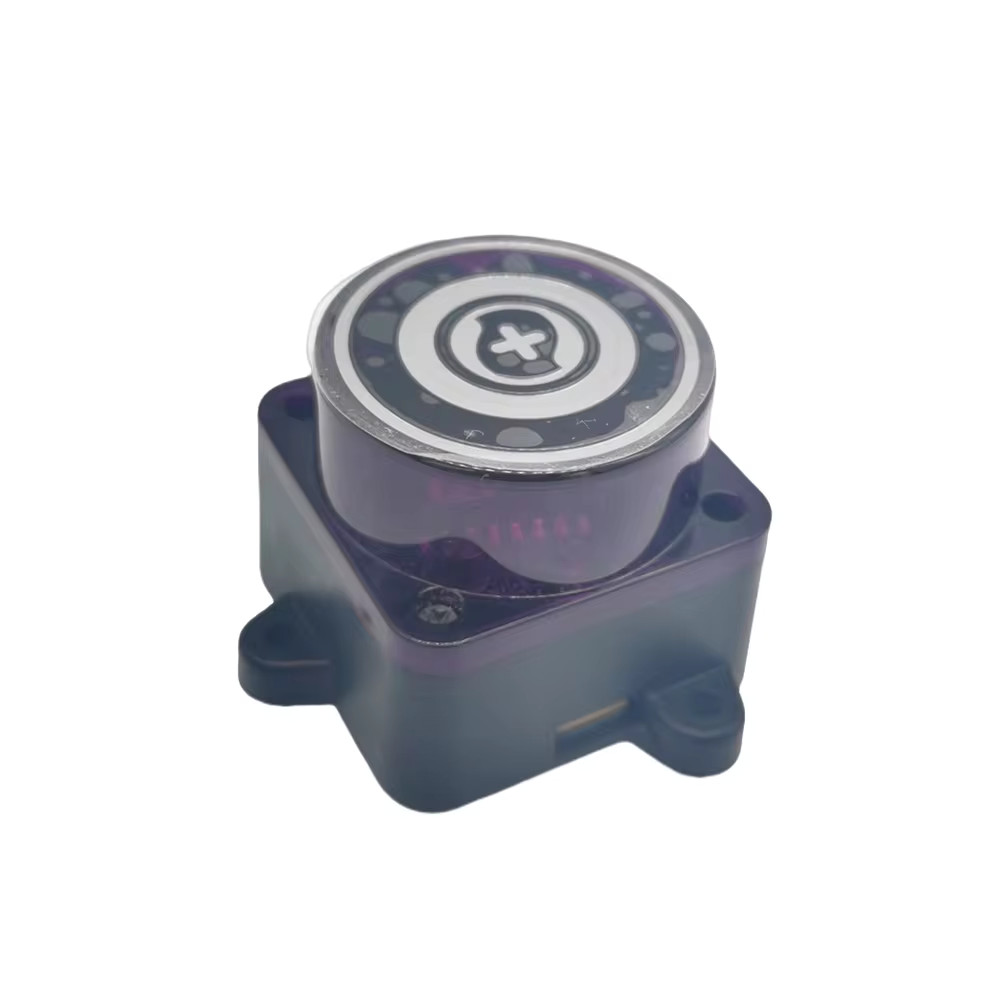
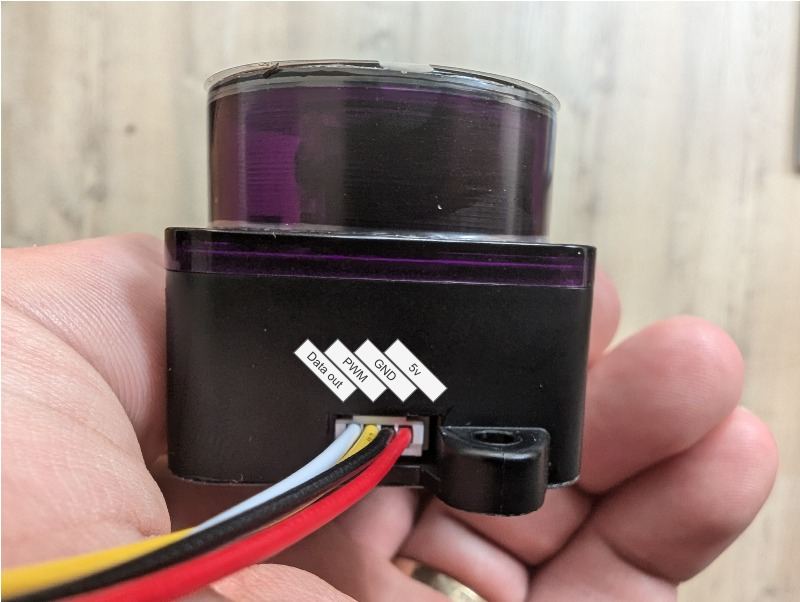

# Weird LD06

A small LD06 lidar but its different than other LD06 lidars



## source:
The lidar seems to be used in the [360 Smart Life S10](https://smart.360.com/robot/s10.html) I found this identical lidar sold as replacement part: [replacment lidar](https://www.ep-mediastore-ab.de/360-s10-mini-lds-lidar-sensor-ld06-p-62332.html)

## Pinout:



To connect to a pc use a usb to usrt "FTDI" adapter,  

Connect the 'Data out' pin to the RX pin of the FTDI adapter also connect the GND and the 5v,  
the PWM pin can be connected to ground if the speed you dont need speed control

## Protocol:

The lidar uses the baudrate of 115200 bps
It send msgs of 36 bytes eatch message contains:
* Static header, 8 bytes
* Speed, 2 bytes
* Start angle, 2 bytes
* 8 samples consisting of 2 bytes distance data and 1 confidence byte
* End angle, 2 bytes
* Some sort of crc unkown

(little endian)

```
<0x55> <0xAA> <0x03> <0x08>
<speed_L> <speed_H>  
<start_angle_L> <start_angle_H>  
8x: <distance_L> <distance_H> <confidence>  
<stop_angle_L> <stop_angle_H>  
<CRC?> <CRC?>  
```

To calculate the angle:  
``` c++
    double start_angle = (pkg->start_angle - 0xA000) / 64.0;
    double end_angle = (pkg->end_angle - 0xA000) / 64.0;

    double diff = (end_angle - start_angle + 360.0);
    if(diff > 360.0)
    {
        diff -= 360.0;
    }
```

Distance is in millimeters

